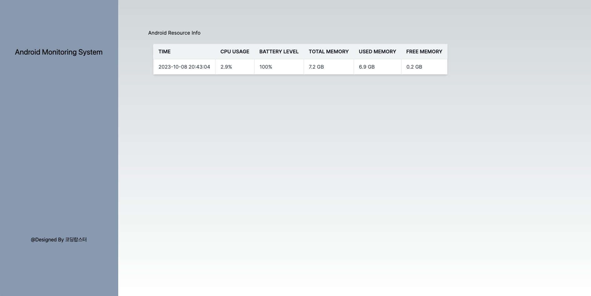

# Android Monitoring System

안드로이드 log를 바탕으로 안드로이드 기기를 모니터링하는 시스템 제작을 위한 프로젝트

## 시스템 아키텍쳐

</img>

## 1차 프로토타입
- 안드로이드 기기의 Process 정보 처리

## 2차 프로토타입
- 안드로이드 기기의 Memory 정보 처리

## 3차 프로토 타입
- 안드로이드 기기의 Resource 정보를 시간과 함께 받아오도록 처리

